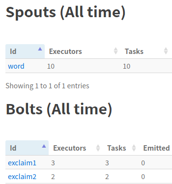
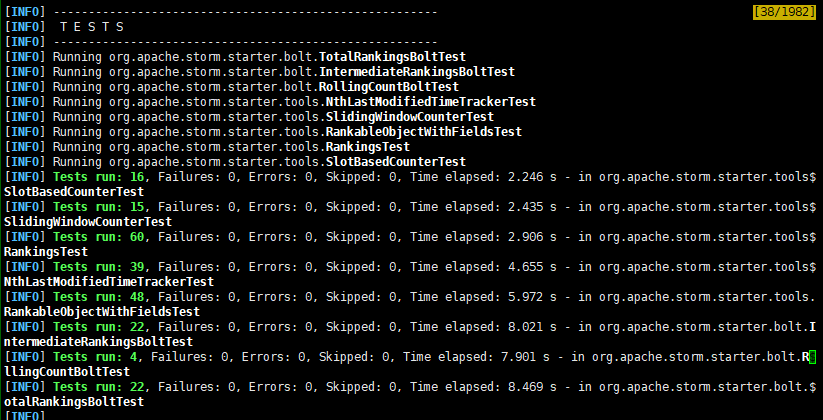

#### 11.11 周三

* 看教程https://www.w3cschool.cn/apache_storm/apache_storm_working_example.html的前面部分
* 在本地部署了一个最基本的storm框架.
* 下一步：
  * 读一下官方教程：http://storm.apache.org/releases/2.2.0/Tutorial.html
  * 运行项目：https://github.com/apache/storm/tree/master/examples/storm-starter

#### 11.18 

* 看storm官方中文文档
  * 我们主要要修改的是 Stream groupings功能，用于确定订阅构成的stream在spout和bolt、bolt和bolt之间如何转发
  * storm有8种内置的Stream groupings，适合我们的是 Fields grouping，即根据字段(订阅id)确定将流发给哪些bolt
* 在jcloud服务器上安装了storm，通过正向端口转发实现了在本地浏览器查看服务器端口上的界面
* 尝试跑storm-starter项目，可以在本地打jar包提交到storm里在ui看到任务，但还不知道怎么用和运行
* 遇到的问题

  * 服务器登录不上了，拒绝访问，jcloud平台也登录不上，后通过修改密码解决
  * 想在本地浏览器打开服务器的端口进而查看界面，反向代理失败，后通过正向转发解决
  
  * mvn clean install -DskipTests=true命令运行报错，后通过本地IDEA右键build解决
  * IDEA的Tools栏里没有deployment功能，不能连上服务器，也就不能build服务器上的项目，最后下载ssh remote插件解决
  * 本地build不成功，后通过下载整个storm项目再build，但不能build单个项目，各种错误，未解决
  * mvn test运行失败，未解决
* 下一步：
  * 读storm-starter源码、看怎么在storm里运行、查看结果
  * 看storm官方文档

#### 11.25

* ui界面结果

  

  

* 跑测试代码（mvn test在服务器上运行成功）

  

* 看storm-starter项目的代码，找到了可用于部署匹配算法的函数

* 本地用storm local命令运行jar包里的例子（给单词结尾加上三个感叹号），在命令行里得到了输出，输入是自动生成的
* 还不清楚怎么查看storm jar命令部署到集群后的输入输出
* 下一步：
  * 继续阅读文档
  * 在B站上找到一个storm教程，可以跟着学
  * 继续读懂storm-starter项目代码，在本地和服务器上运行更多其中的示例

